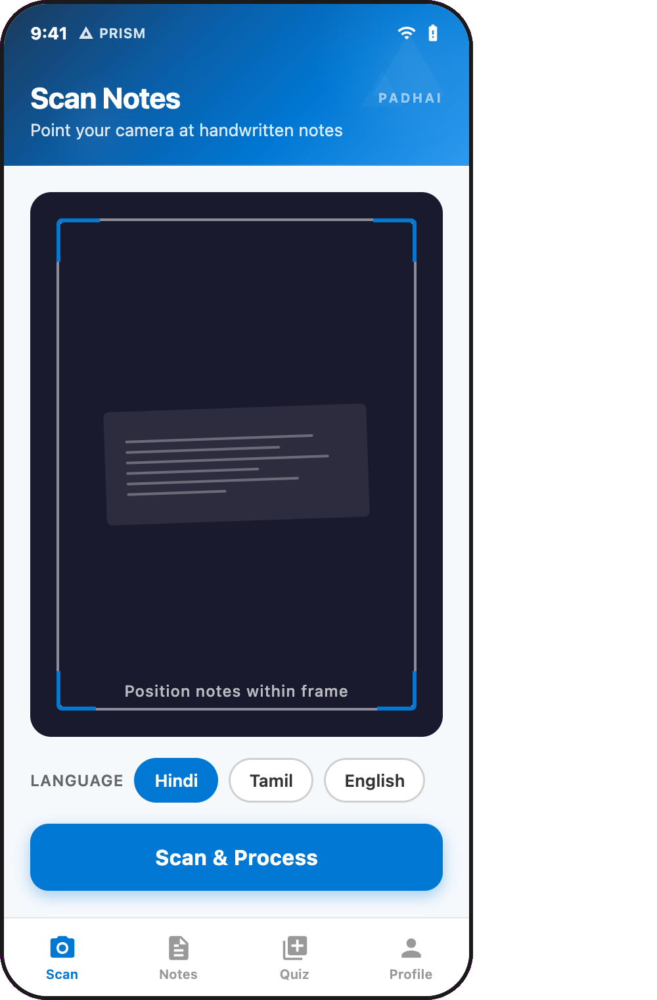
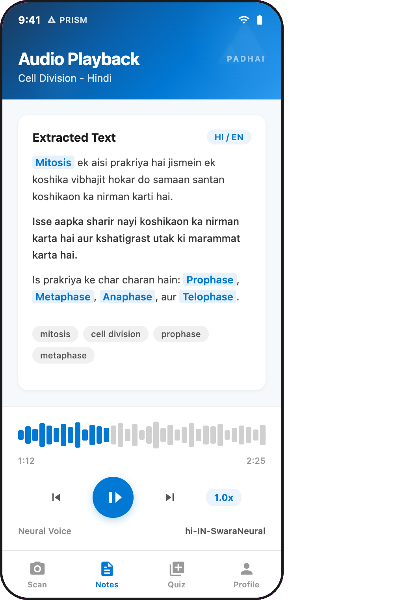
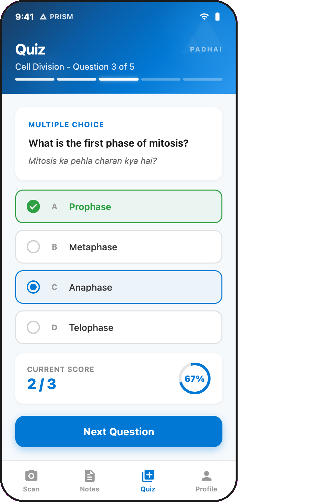
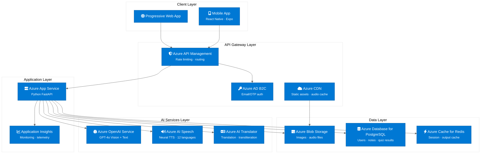
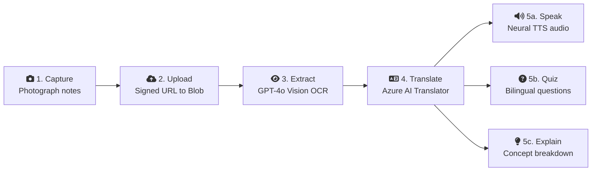
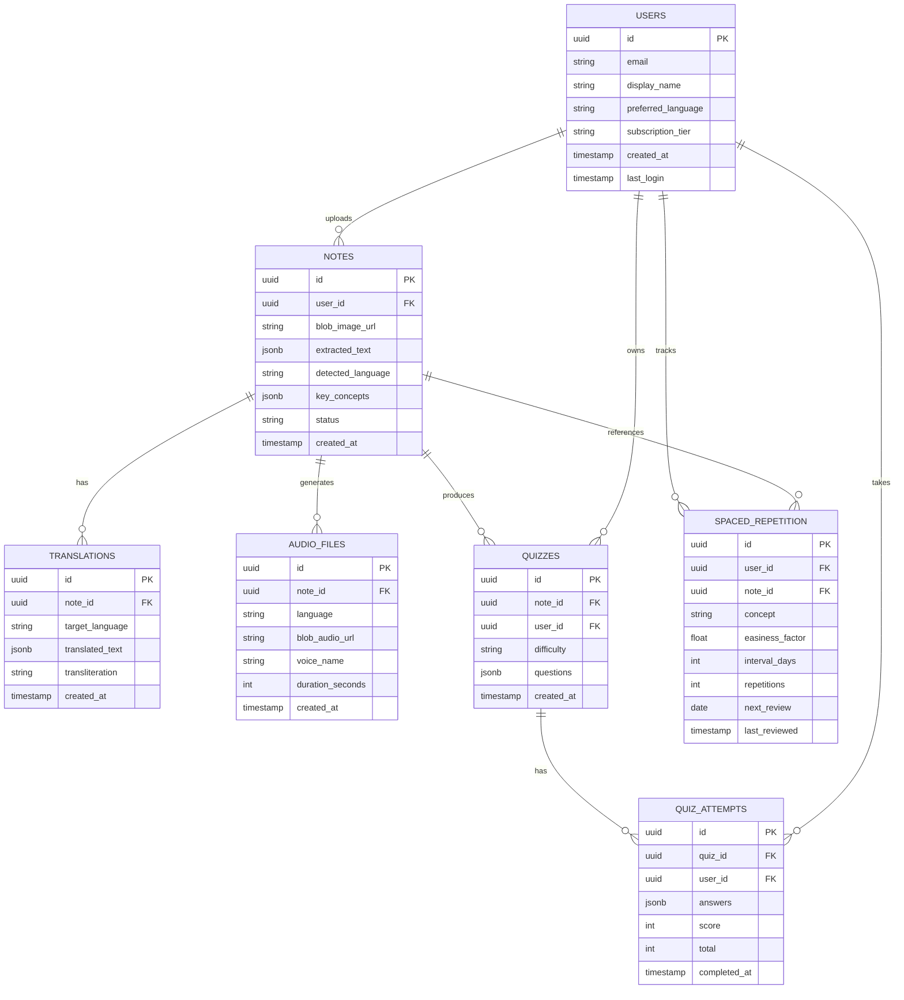
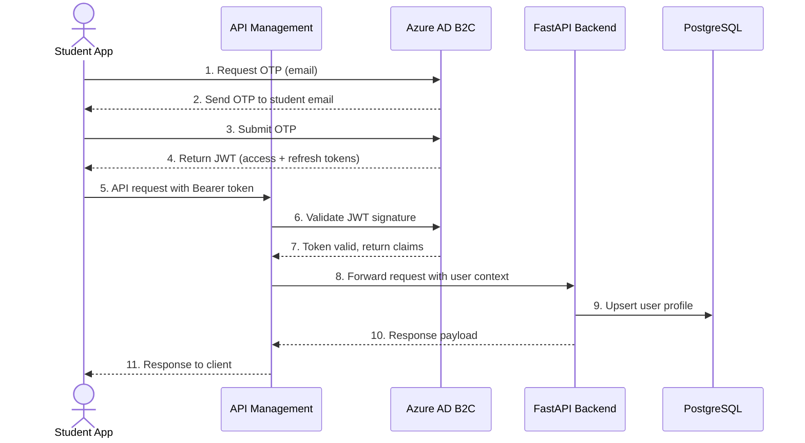
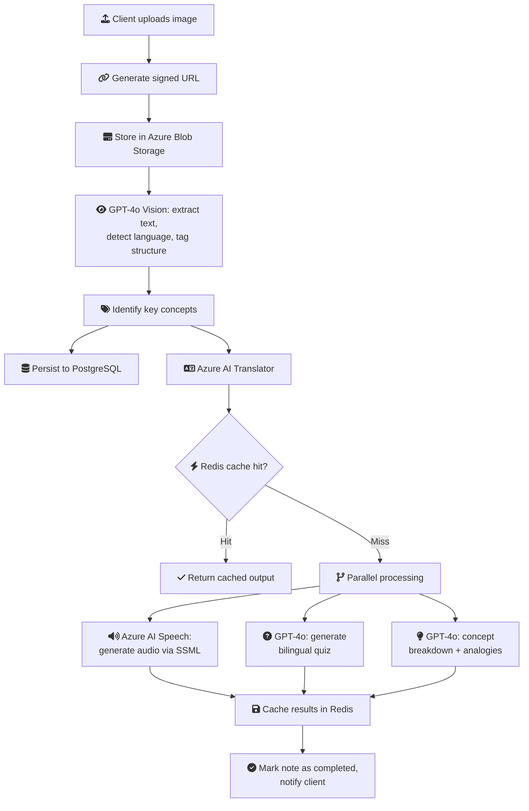

<h1 align="center"><sub>पढ़ाई</sub> &emsp;&emsp;&emsp; <a href="https://github.com/Achxy/msft-ai-unlocked">PadhAI</a> &emsp;&emsp;&emsp; <sub>പഠനം</sub></h1>

[](https://learn.microsoft.com/en-us/azure/ai-services/openai/overview)
[](https://learn.microsoft.com/en-us/azure/ai-services/speech-service/overview)
[](https://learn.microsoft.com/en-us/azure/ai-services/translator/overview)
[](https://reactnative.dev/)
[](https://fastapi.tiangolo.com/)
[](https://learn.microsoft.com/en-us/azure/postgresql/flexible-server/overview)
[](https://learn.microsoft.com/en-us/azure/azure-cache-for-redis/cache-overview)

*AI-powered multilingual study companion for Indian students*

PadhAI (from Hindi *padhai*, meaning "study") transforms messy handwritten notes into structured, interactive, multilingual learning material. Students photograph their notes, and the app digitizes the handwriting using GPT-4o Vision via Azure OpenAI Service, reads the content aloud in 12 Indian languages using Azure AI Speech neural TTS, explains complex concepts with GPT-4o breakdowns translated via Azure AI Translator, and quizzes students with auto-generated bilingual questions. Built for Track 3 (AI Study Buddy) of the Microsoft AI Unlocked hackathon by Team PRISM, MIT Manipal.

<p align="center">
  
  
  
</p>
<p align="center"><em>App interface: note scanning, audio playback, and quiz interface</em></p>

---

## The Problem

74% of Indian students study in non-English media, yet virtually all digital study tools are English-only. Across 248 million school enrollments and 43.3 million higher education students in India, handwritten notes remain the primary study medium for board exams, competitive tests (NEET, JEE, UPSC), and university semesters. Existing OCR apps like Google Lens and Adobe Scan handle printed text but fail on messy, mixed-language handwriting and offer no downstream learning features: no audio narration, no concept breakdowns, no self-testing in the student's own language.

---

## Architecture

### System Architecture



### Azure Services Map

| Azure Service | Role | SKU / Tier |
|---|---|---|
| [](https://learn.microsoft.com/en-us/azure/ai-services/openai/overview) | GPT-4o Vision (handwriting OCR) + GPT-4o Text (quizzes, explanations) | Standard S0 |
| [](https://learn.microsoft.com/en-us/azure/ai-services/speech-service/overview) | Neural TTS in 12 Indian language locales, SSML prosody control | Free (0.5M chars/month), then Standard S0 |
| [](https://learn.microsoft.com/en-us/azure/ai-services/translator/overview) | Real-time text translation, auto language detection, transliteration | Free (2M chars/month), then S1 |
| [](https://learn.microsoft.com/en-us/azure/storage/blobs/storage-blobs-overview) | Original note images, generated TTS audio files | Hot tier, LRS |
| [](https://learn.microsoft.com/en-us/azure/postgresql/flexible-server/overview) | User profiles, extracted text (JSONB), quiz results, analytics | Flexible Server, Burstable B1ms |
| [](https://learn.microsoft.com/en-us/azure/azure-cache-for-redis/cache-overview) | Session state, TTS audio cache, hot note data | Basic C0 (6GB) |
| [](https://learn.microsoft.com/en-us/azure/app-service/overview) | FastAPI backend hosting with auto-scale | B1 (Basic), scale to S1 |
| [](https://learn.microsoft.com/en-us/azure/api-management/api-management-key-concepts) | API gateway, rate limiting, usage analytics | Consumption tier |
| [](https://learn.microsoft.com/en-us/azure/active-directory-b2c/overview) | Student authentication via email/OTP | Free (50K MAU) |
| [](https://learn.microsoft.com/en-us/azure/azure-monitor/app/app-insights-overview) | Performance monitoring, error tracking, request telemetry | Pay-as-you-go |
| [](https://learn.microsoft.com/en-us/azure/cdn/cdn-overview) | Static asset and audio file delivery | Standard Microsoft |

---

## User Flow



The pipeline processes a page of notes in under 10 seconds. Image upload via signed URL (<1s), GPT-4o Vision extraction (2-4s), translation (<1s), then parallel TTS and quiz generation. All outputs are cached in Redis for instant repeat access.

---

## Database Schema

### Entity-Relationship Diagram



### Table Definitions

#### `users`

| Column | Type | Constraints | Description |
|---|---|---|---|
| `id` | `uuid` | PK, default `gen_random_uuid()` | Unique user identifier |
| `email` | `varchar(255)` | UNIQUE, NOT NULL | Email from Azure AD B2C |
| `display_name` | `varchar(100)` | NOT NULL | Student display name |
| `preferred_language` | `varchar(10)` | NOT NULL, default `'en-IN'` | BCP-47 locale code for TTS and translation |
| `subscription_tier` | `varchar(20)` | NOT NULL, default `'free'` | One of: `free`, `student`, `pro` |
| `created_at` | `timestamptz` | NOT NULL, default `now()` | Account creation timestamp |
| `last_login` | `timestamptz` | NULLABLE | Most recent login |

#### `notes`

| Column | Type | Constraints | Description |
|---|---|---|---|
| `id` | `uuid` | PK | Unique note identifier |
| `user_id` | `uuid` | FK -> `users.id`, NOT NULL | Owner |
| `blob_image_url` | `text` | NOT NULL | Azure Blob Storage URL for the original image |
| `extracted_text` | `jsonb` | NULLABLE | Structured OCR output (see schema below) |
| `detected_language` | `varchar(10)` | NULLABLE | Primary language detected by GPT-4o Vision |
| `key_concepts` | `jsonb` | NULLABLE | Array of extracted concept strings |
| `status` | `varchar(20)` | NOT NULL, default `'processing'` | One of: `processing`, `completed`, `failed` |
| `created_at` | `timestamptz` | NOT NULL, default `now()` | Upload timestamp |

`extracted_text` JSONB schema:

```json
{
  "raw_text": "Mitosis is the process of cell division where a single cell divides...",
  "structured": [
    { "type": "heading", "content": "Cell Division" },
    { "type": "paragraph", "content": "Mitosis is the process..." },
    { "type": "list", "items": ["Prophase", "Metaphase", "Anaphase", "Telophase"] }
  ],
  "detected_languages": ["en", "hi"]
}
```

#### `translations`

| Column | Type | Constraints | Description |
|---|---|---|---|
| `id` | `uuid` | PK | Unique translation identifier |
| `note_id` | `uuid` | FK -> `notes.id`, NOT NULL | Source note |
| `target_language` | `varchar(10)` | NOT NULL | BCP-47 locale code |
| `translated_text` | `jsonb` | NOT NULL | Same structure as `notes.extracted_text` but in target language |
| `transliteration` | `text` | NULLABLE | Romanized transliteration of the translation |
| `created_at` | `timestamptz` | NOT NULL, default `now()` | Translation timestamp |

#### `audio_files`

| Column | Type | Constraints | Description |
|---|---|---|---|
| `id` | `uuid` | PK | Unique audio identifier |
| `note_id` | `uuid` | FK -> `notes.id`, NOT NULL | Source note |
| `language` | `varchar(10)` | NOT NULL | BCP-47 locale code |
| `blob_audio_url` | `text` | NOT NULL | Azure Blob Storage URL for the MP3 |
| `voice_name` | `varchar(50)` | NOT NULL | Azure neural voice name (e.g. `hi-IN-SwaraNeural`) |
| `duration_seconds` | `integer` | NULLABLE | Audio length |
| `created_at` | `timestamptz` | NOT NULL, default `now()` | Audio generation timestamp |

#### `quizzes`

| Column | Type | Constraints | Description |
|---|---|---|---|
| `id` | `uuid` | PK | Unique quiz identifier |
| `note_id` | `uuid` | FK -> `notes.id`, NOT NULL | Source note |
| `user_id` | `uuid` | FK -> `users.id`, NOT NULL | Quiz owner |
| `difficulty` | `varchar(20)` | NOT NULL, default `'intermediate'` | One of: `beginner`, `intermediate`, `advanced` |
| `questions` | `jsonb` | NOT NULL | Array of question objects (see schema below) |
| `created_at` | `timestamptz` | NOT NULL, default `now()` | Quiz generation timestamp |

`questions` JSONB schema:

```json
[
  {
    "type": "mcq",
    "question": "What is the first phase of mitosis?",
    "question_translated": "Mitosis ka pehla charan kya hai?",
    "options": ["Prophase", "Metaphase", "Anaphase", "Telophase"],
    "correct": 0,
    "explanation": "Prophase is the first phase where chromosomes condense."
  },
  {
    "type": "fill_blank",
    "question": "During _____, chromosomes line up at the cell's equator.",
    "question_translated": "_____ ke dauran, chromosomes koshika ke madhya mein line mein aate hain.",
    "correct": "Metaphase"
  },
  {
    "type": "short_answer",
    "question": "Explain the difference between mitosis and meiosis.",
    "question_translated": "Mitosis aur meiosis mein antar samjhaiye.",
    "sample_answer": "Mitosis produces two identical diploid cells, while meiosis produces four genetically different haploid cells."
  }
]
```

#### `quiz_attempts`

| Column | Type | Constraints | Description |
|---|---|---|---|
| `id` | `uuid` | PK | Unique attempt identifier |
| `quiz_id` | `uuid` | FK -> `quizzes.id`, NOT NULL | Quiz taken |
| `user_id` | `uuid` | FK -> `users.id`, NOT NULL | Student |
| `answers` | `jsonb` | NOT NULL | Array of answer objects with correctness |
| `score` | `integer` | NOT NULL | Number of correct answers |
| `total` | `integer` | NOT NULL | Total questions |
| `completed_at` | `timestamptz` | NOT NULL, default `now()` | Attempt completion timestamp |

`answers` JSONB schema:

```json
[
  { "question_id": 0, "selected": 0, "correct": true },
  { "question_id": 1, "answer": "Metaphase", "correct": true },
  { "question_id": 2, "answer": "Mitosis makes two same cells...", "score": 0.7 }
]
```

#### `spaced_repetition`

| Column | Type | Constraints | Description |
|---|---|---|---|
| `id` | `uuid` | PK | Unique record identifier |
| `user_id` | `uuid` | FK -> `users.id`, NOT NULL | Student |
| `note_id` | `uuid` | FK -> `notes.id`, NOT NULL | Source note |
| `concept` | `varchar(200)` | NOT NULL | Concept string from `notes.key_concepts` |
| `easiness_factor` | `float` | NOT NULL, default `2.5` | SM-2 easiness multiplier |
| `interval_days` | `integer` | NOT NULL, default `1` | Days until next review |
| `repetitions` | `integer` | NOT NULL, default `0` | Consecutive successful reviews |
| `next_review` | `date` | NOT NULL | Next scheduled review date |
| `last_reviewed` | `timestamptz` | NULLABLE | Last review timestamp |

---

## API Reference

All endpoints require a valid Bearer token obtained from Azure AD B2C. Responses use `application/json` unless otherwise noted.

Base URL: `https://padhai-api.azurewebsites.net`

### `POST /api/notes/upload`

Upload a note image for OCR processing. Returns immediately with a note ID; processing happens asynchronously.

**Request:**

```
POST /api/notes/upload
Content-Type: multipart/form-data
Authorization: Bearer <token>
```

| Field | Type | Required | Description |
|---|---|---|---|
| `image` | `file` | Yes | JPEG/PNG image of handwritten notes |
| `preferred_language` | `string` | No | BCP-47 locale for translation (default: user's `preferred_language`) |

**Response (202 Accepted):**

```json
{
  "note_id": "a1b2c3d4-e5f6-7890-abcd-ef1234567890",
  "status": "processing",
  "blob_url": "https://padhaistorage.blob.core.windows.net/notes/a1b2c3d4.jpg",
  "estimated_seconds": 8
}
```

Rate limit: 5 uploads/day (Free tier), unlimited (Student/Pro).

---

### `GET /api/notes/{id}`

Retrieve a processed note with extracted text, detected languages, and key concepts.

**Request:**

```
GET /api/notes/a1b2c3d4-e5f6-7890-abcd-ef1234567890
Authorization: Bearer <token>
```

**Response (200 OK):**

```json
{
  "id": "a1b2c3d4-e5f6-7890-abcd-ef1234567890",
  "status": "completed",
  "blob_image_url": "https://padhaistorage.blob.core.windows.net/notes/a1b2c3d4.jpg",
  "extracted_text": {
    "raw_text": "Mitosis is the process of cell division where a single cell divides to produce two identical daughter cells.",
    "structured": [
      { "type": "heading", "content": "Cell Division" },
      { "type": "paragraph", "content": "Mitosis is the process of cell division..." },
      { "type": "list", "items": ["Prophase", "Metaphase", "Anaphase", "Telophase"] }
    ],
    "detected_languages": ["en", "hi"]
  },
  "key_concepts": ["mitosis", "cell division", "prophase", "metaphase", "anaphase", "telophase"],
  "detected_language": "en",
  "created_at": "2026-02-26T10:30:00Z"
}
```

Returns `status: "processing"` with no `extracted_text` if OCR is still running. Returns `status: "failed"` with an `error` field if extraction failed.

---

### `POST /api/notes/explain`

Generate a concept breakdown with analogies, translated into the target language.

**Request:**

```json
{
  "note_id": "a1b2c3d4-e5f6-7890-abcd-ef1234567890",
  "concept": "mitosis",
  "target_language": "hi"
}
```

**Response (200 OK):**

```json
{
  "note_id": "a1b2c3d4-e5f6-7890-abcd-ef1234567890",
  "concept": "mitosis",
  "explanation": {
    "en": "Mitosis is the process where a single cell divides to produce two identical daughter cells. It is how your body grows new cells and repairs damaged tissue.",
    "hi": "Mitosis ek aisi prakriya hai jismein ek koshika vibhajit hokar do samaan santan koshikaon ka nirman karti hai. Isse aapka sharir nayi koshikaon ka nirman karta hai aur kshatigrast utak ki marammat karta hai."
  },
  "analogy": {
    "en": "Think of mitosis like photocopying a document: the original stays intact, and you get an exact copy.",
    "hi": "Mitosis ko aise samjhein jaise ek document ki photocopy banana: original waisa hi rehta hai, aur aapko ek bilkul same copy milti hai."
  },
  "key_points": [
    "Produces two genetically identical cells",
    "Occurs in somatic (body) cells, not reproductive cells",
    "Four phases: Prophase, Metaphase, Anaphase, Telophase"
  ]
}
```

Cached in Redis; repeat requests for the same note + concept + language return instantly.

---

### `POST /api/notes/quiz`

Generate bilingual quiz questions from note content. Supports MCQ, fill-in-the-blank, and short answer formats.

**Request:**

```json
{
  "note_id": "a1b2c3d4-e5f6-7890-abcd-ef1234567890",
  "target_language": "hi",
  "question_count": 5,
  "types": ["mcq", "fill_blank", "short_answer"]
}
```

**Response (200 OK):**

```json
{
  "quiz_id": "q1r2s3t4-u5v6-7890-wxyz-ab1234567890",
  "note_id": "a1b2c3d4-e5f6-7890-abcd-ef1234567890",
  "difficulty": "intermediate",
  "questions": [
    {
      "id": 0,
      "type": "mcq",
      "question": "What is the first phase of mitosis?",
      "question_translated": "Mitosis ka pehla charan kya hai?",
      "options": ["Prophase", "Metaphase", "Anaphase", "Telophase"],
      "correct": 0
    },
    {
      "id": 1,
      "type": "fill_blank",
      "question": "During _____, chromosomes line up at the cell's equator.",
      "question_translated": "_____ ke dauran, chromosomes koshika ke madhya mein line mein aate hain.",
      "correct": "Metaphase"
    },
    {
      "id": 2,
      "type": "short_answer",
      "question": "Explain the difference between mitosis and meiosis.",
      "question_translated": "Mitosis aur meiosis mein antar samjhaiye.",
      "sample_answer": "Mitosis produces two identical diploid cells for growth and repair, while meiosis produces four genetically different haploid cells for reproduction."
    },
    {
      "id": 3,
      "type": "mcq",
      "question": "In which phase do sister chromatids separate?",
      "question_translated": "Kis charan mein sister chromatids alag hote hain?",
      "options": ["Prophase", "Metaphase", "Anaphase", "Telophase"],
      "correct": 2
    },
    {
      "id": 4,
      "type": "fill_blank",
      "question": "The cell plate forms during _____ in plant cells.",
      "question_translated": "Paudhe ki koshikaon mein _____ ke dauran cell plate banti hai.",
      "correct": "Telophase"
    }
  ],
  "created_at": "2026-02-26T10:31:00Z"
}
```

Difficulty adapts based on the student's past quiz performance stored in `quiz_attempts`.

---

### `POST /api/notes/translate`

Translate extracted note content to a target language with optional transliteration.

**Request:**

```json
{
  "note_id": "a1b2c3d4-e5f6-7890-abcd-ef1234567890",
  "target_language": "ta",
  "include_transliteration": true
}
```

**Response (200 OK):**

```json
{
  "translation_id": "t1u2v3w4-x5y6-7890-abcd-ef1234567890",
  "note_id": "a1b2c3d4-e5f6-7890-abcd-ef1234567890",
  "source_language": "en",
  "target_language": "ta",
  "translated_text": {
    "raw_text": "Mitosis endrappathu oru sellil irunthu irandu oppaana makal selkalai uruvakkum sel pirivu seyalmurai aakum.",
    "structured": [
      { "type": "heading", "content": "Sel Pirivu" },
      { "type": "paragraph", "content": "Mitosis endrappathu oru sellil irunthu..." },
      { "type": "list", "items": ["Prophase nilai", "Metaphase nilai", "Anaphase nilai", "Telophase nilai"] }
    ]
  },
  "transliteration": "Mitosis enpathu oru sellil irunthu irandu oppana makal selkalai uruvakkum sel pirivu seyalmuRai aakum.",
  "cached": false
}
```

Uses Azure AI Translator with auto-detection for mixed-language notes. Transliteration converts the target script to Latin characters for readability.

---

### `POST /api/notes/speak`

Generate TTS audio for a note in a specified language and voice.

**Request:**

```json
{
  "note_id": "a1b2c3d4-e5f6-7890-abcd-ef1234567890",
  "language": "hi-IN",
  "voice": "hi-IN-SwaraNeural",
  "speed": 1.0
}
```

**Response (200 OK):**

```json
{
  "audio_id": "au1d2i3o-4f5i-6789-abcd-ef1234567890",
  "note_id": "a1b2c3d4-e5f6-7890-abcd-ef1234567890",
  "language": "hi-IN",
  "voice": "hi-IN-SwaraNeural",
  "blob_audio_url": "https://padhaistorage.blob.core.windows.net/audio/au1d2i3o.mp3",
  "duration_seconds": 145,
  "cached": true
}
```

Audio is generated using SSML markup for natural pacing, emphasis on technical terms, and phonetic hints on transliterated content. Results are cached in Redis; the `cached` field indicates whether this was served from cache (cutting TTS regeneration costs by approximately 70%).

---

### `GET /api/quiz/{id}/results`

Retrieve quiz results, performance analytics, and spaced repetition scheduling.

**Request:**

```
GET /api/quiz/q1r2s3t4-u5v6-7890-wxyz-ab1234567890/results
Authorization: Bearer <token>
```

**Response (200 OK):**

```json
{
  "quiz_id": "q1r2s3t4-u5v6-7890-wxyz-ab1234567890",
  "user_id": "u1s2e3r4-i5d6-7890-abcd-ef1234567890",
  "score": 4,
  "total": 5,
  "percentage": 80.0,
  "answers": [
    { "question_id": 0, "selected": 0, "correct": true },
    { "question_id": 1, "answer": "Metaphase", "correct": true },
    { "question_id": 2, "answer": "Mitosis makes two same cells, meiosis makes four different cells.", "score": 0.7 },
    { "question_id": 3, "selected": 2, "correct": true },
    { "question_id": 4, "answer": "Anaphase", "correct": false }
  ],
  "weak_concepts": ["telophase", "cell plate formation"],
  "next_review": "2026-03-01",
  "completed_at": "2026-02-26T10:35:00Z"
}
```

Weak concepts are fed into the spaced repetition scheduler to prioritize review. The `next_review` date is computed by the SM-2 algorithm based on cumulative performance.

---

## Authentication Flow



Azure AD B2C handles the full identity lifecycle. The primary authentication flow is email OTP: students enter their email, receive a one-time passcode, and submit it to receive a JWT pair. The access token (short-lived, 1 hour) is attached to every API request as a Bearer token. The refresh token (long-lived, 14 days) allows silent re-authentication without re-entering OTP. API Management validates tokens at the gateway layer before any request reaches the FastAPI backend, keeping auth concerns out of application code.

---

## Processing Pipeline



### Pipeline Latency

| Stage | Azure Service | Latency |
|---|---|---|
| Image upload (signed URL) | [](https://learn.microsoft.com/en-us/azure/storage/blobs/storage-blobs-overview) | <1s |
| Text extraction + structuring | [](https://learn.microsoft.com/en-us/azure/ai-services/openai/overview) GPT-4o Vision | 2-4s |
| Translation | [](https://learn.microsoft.com/en-us/azure/ai-services/translator/overview) | <1s |
| TTS audio generation | [](https://learn.microsoft.com/en-us/azure/ai-services/speech-service/overview) | 1-3s |
| Quiz generation | [](https://learn.microsoft.com/en-us/azure/ai-services/openai/overview) GPT-4o Text | 2-3s |
| Concept breakdown | [](https://learn.microsoft.com/en-us/azure/ai-services/openai/overview) GPT-4o Text | 2-3s |
| **End-to-end (first request)** | All services (parallel) | **<10s** |
| **Repeat access (cached)** | [](https://learn.microsoft.com/en-us/azure/azure-cache-for-redis/cache-overview) | **<100ms** |

Steps 5a/5b/5c (TTS, quiz, explain) run in parallel after translation completes, so total wall time is bounded by the slowest branch, not their sum.

---

## Spaced Repetition

PadhAI uses a modified SM-2 spaced repetition algorithm to schedule concept reviews. Each concept extracted from a student's notes gets an independent repetition schedule based on quiz performance.

### Algorithm Parameters

| Parameter | Description | Initial Value |
|---|---|---|
| `easiness_factor` | Multiplier controlling how fast intervals grow | 2.5 |
| `interval_days` | Days until the next review is due | 1 |
| `repetitions` | Count of consecutive successful reviews | 0 |

### SM-2 Implementation

```python
def update_sm2(easiness_factor: float, interval: int, repetitions: int, quality: int):
    """Update spaced repetition parameters after a review.

    Args:
        easiness_factor: Current EF (minimum 1.3).
        interval: Current interval in days.
        repetitions: Consecutive correct reviews.
        quality: 0-5 score. 0-2 = incorrect, 3 = hard, 4 = good, 5 = easy.

    Returns:
        Tuple of (new_easiness_factor, new_interval, new_repetitions).
    """
    if quality >= 3:  # Correct response
        if repetitions == 0:
            interval = 1
        elif repetitions == 1:
            interval = 6
        else:
            interval = round(interval * easiness_factor)
        repetitions += 1
    else:  # Incorrect response: reset
        repetitions = 0
        interval = 1

    easiness_factor = max(
        1.3,
        easiness_factor + 0.1 - (5 - quality) * (0.08 + (5 - quality) * 0.02),
    )

    return easiness_factor, interval, repetitions
```

Quiz scores map to SM-2 quality ratings: 0-39% = 1, 40-59% = 2, 60-69% = 3, 70-84% = 4, 85-100% = 5. A quality below 3 resets the repetition count, forcing the concept back to a 1-day review interval.

---

## Supported Languages

All TTS voices are Azure AI Speech neural voices. SSML markup controls pacing, adds emphasis to technical terms, and provides phonetic hints for transliterated content.

| Language | Locale | Neural Voice (Female) | Neural Voice (Male) | Script |
|---|---|---|---|---|
| [Hindi][tr] | `hi-IN` | [`hi-IN-SwaraNeural`][tts] | [`hi-IN-MadhurNeural`][tts] | [Devanagari][s-deva] |
| [Tamil][tr] | `ta-IN` | [`ta-IN-PallaviNeural`][tts] | [`ta-IN-ValluvarNeural`][tts] | [Tamil][s-taml] |
| [Telugu][tr] | `te-IN` | [`te-IN-ShrutiNeural`][tts] | [`te-IN-MohanNeural`][tts] | [Telugu][s-telu] |
| [Kannada][tr] | `kn-IN` | [`kn-IN-SapnaNeural`][tts] | [`kn-IN-GaganNeural`][tts] | [Kannada][s-knda] |
| [Bengali][tr] | `bn-IN` | [`bn-IN-TanishaaNeural`][tts] | [`bn-IN-BashkarNeural`][tts] | [Bengali][s-beng] |
| [Marathi][tr] | `mr-IN` | [`mr-IN-AarohiNeural`][tts] | [`mr-IN-ManoharNeural`][tts] | [Devanagari][s-deva] |
| [Gujarati][tr] | `gu-IN` | [`gu-IN-DhwaniNeural`][tts] | [`gu-IN-NiranjanNeural`][tts] | [Gujarati][s-gujr] |
| [Malayalam][tr] | `ml-IN` | [`ml-IN-SobhanaNeural`][tts] | [`ml-IN-MidhunNeural`][tts] | [Malayalam][s-mlym] |
| [Punjabi][tr] | `pa-IN` | [`pa-IN-VaaniNeural`][tts] | [`pa-IN-OjasNeural`][tts] | [Gurmukhi][s-guru] |
| [Odia][tr] | `or-IN` | [`or-IN-SubhasiniNeural`][tts] | [`or-IN-SukantNeural`][tts] | [Odia][s-orya] |
| [Urdu][tr] | `ur-IN` | [`ur-IN-GulNeural`][tts] | [`ur-IN-SalmanNeural`][tts] | [Nastaliq][s-nastq] |
| [English (India)][tr] | `en-IN` | [`en-IN-NeerjaNeural`][tts] | [`en-IN-PrabhatNeural`][tts] | [Latin][s-latn] |

[tts]: https://learn.microsoft.com/en-us/azure/ai-services/speech-service/language-support?tabs=tts
[tr]: https://learn.microsoft.com/en-us/azure/ai-services/translator/language-support
[s-deva]: https://en.wikipedia.org/wiki/Devanagari
[s-taml]: https://en.wikipedia.org/wiki/Tamil_script
[s-telu]: https://en.wikipedia.org/wiki/Telugu_script
[s-knda]: https://en.wikipedia.org/wiki/Kannada_script
[s-beng]: https://en.wikipedia.org/wiki/Bengali%E2%80%93Assamese_script
[s-gujr]: https://en.wikipedia.org/wiki/Gujarati_script
[s-mlym]: https://en.wikipedia.org/wiki/Malayalam_script
[s-guru]: https://en.wikipedia.org/wiki/Gurmukhi
[s-orya]: https://en.wikipedia.org/wiki/Odia_script
[s-nastq]: https://en.wikipedia.org/wiki/Nastaliq
[s-latn]: https://en.wikipedia.org/wiki/Latin_script

Hindi, Tamil, Telugu, Kannada, and Bengali are available at launch. Remaining languages are enabled progressively as prompt templates and SSML tuning are validated per language.

